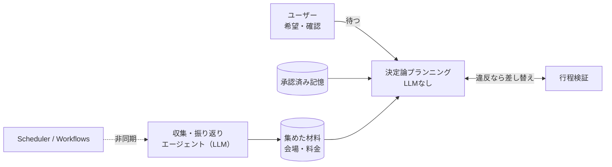

ハッカソンで「ふたりログ」というデート計画アプリを作りました。二人の希望を聞いて一日の行程を組み、予定が崩れたら組み直し、振り返りを次のデートに活かすWebアプリです。

このアプリでいちばん頭を使ったのが「AIをどこで動かすか」でした。結論を先に書くと、**ユーザーが結果を待っている経路からはLLMを外し、決定論的なロジックだけでプランを組む**という設計にしています。その前後で初回プランの待ち時間が実測で66秒から18秒に縮みました。

この記事では、その設計判断にたどり着くまでと、実際にどう作ったかを実測値つきで書きます。

## 最初のプランが「66秒」かかっていた

まず動くものを作った段階では、プラン生成の中でGeminiに検索（grounding）を同期で呼んでいました。ユーザーが「この条件でプランを作る」を押すと、裏でGeminiが会場情報を集めてくるのを待ってから行程を返す作りです。

これが遅い。Cloud Run上で実測すると、初回プランが表示されるまでの所要は次のとおりでした。

| 区間 | 所要 |
| --- | --- |
| run 作成 → 完了 | 66,148 ms |
| クライアントPOST → 画面反映 | 68,129 ms |

内訳を追うと、66秒のうち約51.7秒が同期のGemini groundingでした。デートの予定を1つ立てるのに1分以上ローディングを眺めるのは、デモでも実利用でも厳しい。

## なぜLLMが「待ち時間の主犯」になりやすいのか

LLMは便利ですが、レイテンシが読めません。プロンプト次第で数秒から数十秒まで振れるうえ、検索を挟むとさらに伸びます。しかもデート計画の本体、つまり「どの店を、どの順番で、何分ずつ回るか」を決める部分は、実はLLMの推論よりも制約の解き方の問題です。

- 営業時間内に収まっているか
- 移動時間を足しても予算と時間に収まるか
- 二人の希望（座って休みたい、など）に反していないか

これらは条件を照合すれば決まります。ここにLLMを噛ませると、遅くなるうえに出力がぶれて、営業時間を無視した行程が返ってくることすらある。

要するに、**LLMが得意なのは「材料を集める」ことで、行程を確定させる部分はむしろ決定論のほうが速くて安定する**。この切り分けが設計の軸になりました。

## 設計：待つ経路は決定論、集める仕事は非同期エージェント

処理を2つの世界に分けました。

**1. ユーザーが待つ経路（同期・LLMなし）**
希望・過去の記憶・営業時間・移動時間を照合して行程を組む「決定論的プランニング」。ここではLLMを一切呼びません。実行ログ上もモデルは `deterministic/planner` と記録され、トークン消費はゼロです。

**2. 材料を集める経路（非同期・LLMあり）**
イベント収集、料金の裏取り、振り返りの分析といった「時間がかかってもいい仕事」は、バックグラウンドのエージェントに逃がします。Cloud SchedulerやWorkflowsから非同期runとして起動し、結果はFirestoreに貯めておく。次にプランを組むときは、その貯めた材料を決定論プランナーが読むだけです。

ポイントは、ユーザーの待ち時間とLLMのレイテンシを切り離したことです。LLMが5秒かかろうが30秒かかろうが、それは裏で回るだけで、ユーザーが見ているローディングには影響しません。

## 決定論プランナーが実際にやっていること

「決定論」と言っても、単に候補を並べているわけではありません。組んだ行程を検証し、違反があれば候補を差し替えて再検証するループが入っています。

たとえば東京の各エリアで実際に走らせたとき、渋谷では最初に組んだ行程が検証に引っかかりました。そこで営業確認の取れた候補に1回だけ差し替え、再検証を通してからプランを確定しています。ログ上は `VALIDATION_FAILED` → `SELF_CORRECTED`（1回）→ `PLAN_APPLIED` という流れです。

営業時間の判定にも一つ工夫があります。祝日はGoogle Placesの通常営業時間（`regularOpeningHours`）だけ見ると休業扱いになりがちですが、当日の日付が一致する `currentOpeningHours` を優先することで、祝日営業を正しくOPENと判定できます。敬老の日に走らせたとき、通常営業では月曜休館だった美術館が、当日日付つきの営業情報で開館として行程に載りました。

こうした判定はすべて条件照合で、LLMは登場しません。だから速いし、同じ入力なら同じ結果が返ります。

## LLMは「承認された記憶」を通してだけプランに効く

では振り返りの分析（LLMの担当）は、どうやってプランに反映されるのか。ここも一段クッションを置いています。

振り返りエージェントが記録を分析して「次は座れる休憩を多めに」といった記憶の候補を作ります。ただし、この候補は**ユーザーが明示的に承認するまでプランに一切影響しません**。承認されて初めて、型付きのディレクティブ（たとえば `PREFER_SEATED_REST`）として次のプランに効きます。

実測では、この記憶ありとなしで滞在時間の組み方が変わることを確認しました。同じ材料でプランを組み直すと、`PREFER_SEATED_REST` が効いた回では立ちっぱなしになりやすいスポットの滞在が50分から35分に丸められ、その差分はすべてこのディレクティブで説明がつきました。

LLMの出力をそのままプランに流し込まず、「承認済みの構造化データ」という決定論プランナーが読める形に一度変換している。これが、LLMの気まぐれをユーザー体験から遠ざける二段目の仕組みです。

## 結果

同期groundingを初回プラン経路から外した前後で、待ち時間はこう変わりました。

| 指標 | Before | After |
| --- | --- | --- |
| 初回プラン所要 | 66,148 ms | 17,854 ms |
| 初回プラン経路のLLM | 同期groundingあり（約51.7s） | なし（`deterministic/planner` のみ） |

約73%の短縮です。LLMを「使わない」のではなく、「ユーザーが待たない場所で使う」に置き換えただけで、体験の重さがほぼ消えました。

## まとめ

LLMを組み込むとき、つい「どう賢く使うか」に意識が向きますが、今回いちばん効いたのは「どこで使わないか」を決めたことでした。

- 行程を確定させる部分は決定論に寄せると、速くて結果が安定する
- LLMは材料集めと分析に回し、非同期で貯めておく
- LLMの出力は承認済みの構造化データを経由してからプランに効かせる

ユーザーが待つ経路とLLMのレイテンシを切り離す。この一線を引くだけで、同じ機能でも体験はまったく変わります。ハッカソンという締め切りの中で、いちばん投資対効果が高かった判断でした。
